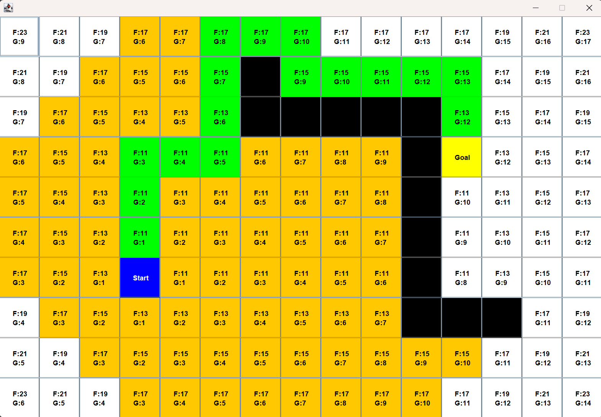

# A* Pathfinding Visualizer (Java)

This project implements the **A\*** pathfinding algorithm in **Java**, providing a real-time visual representation of shortest path calculations.  
It uses **Swing** and **AWT** for GUI rendering, making it interactive and educational.

## Features
- 🟢 **Interactive Grid** – Set start, end, and obstacle nodes with mouse clicks.  
- 🔍 **Real-Time Visualization** – Step-by-step execution of the A\* algorithm.  
- ⚙ **Customizable Settings** – Adjustable grid size and heuristic parameters.  
- 📍 **Path Highlighting** – Shows explored nodes, frontier nodes, and the optimal path.  

## Tech Stack
- **Java** (Core, Collections)
- **Swing** & **AWT** (GUI and event handling)

## How It Works
1. Select a start and end point on the grid.
2. Add obstacles to block certain paths.
3. Run the algorithm to see A\* in action.
4. The visualizer highlights:
   - Explored nodes
   - Nodes in the frontier
   - Final optimal path

# Demo


## Screenshot


## Use Cases
- 📚 Educational tool for understanding A\* search.
- 🎮 Base logic for game AI navigation.
- 🤖 Path optimization in robotics.

## Getting Started
1. Clone the repository:
   ```bash
   git clone https://github.com/your-username/a-star-pathfinding-java.git
